# messaging-app

This is the frontend for a messaging app called "StarSend" that allows users to register accounts for privately messaging others. Users are also able to customize their profiles, which show up when being searched by others. The frontend is built with React + TypeScript and is styled with Tailwind. The backend is built with Go and interacts with a PostgreSQL database.

The backend repository can be found here: https://github.com/ken-ux/messaging-app-api

Note: This is still a work-in-progress so there's no live version yet.

## Screenshots

These are the wireframes made in Figma vs. the final version of the app seen in a browser.

|    Screen    |                            Wireframe Version                             |                        Final Version                         |
| :----------: | :----------------------------------------------------------------------: | :----------------------------------------------------------: |
|     Home     |                                   N/A                                    |       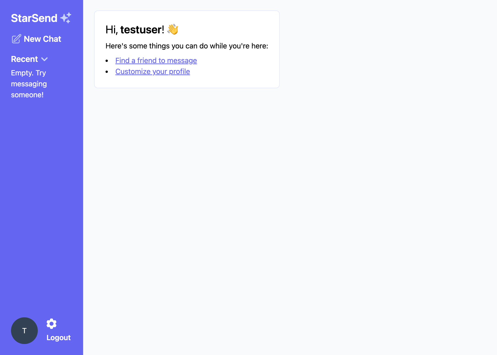       |
|    Login     |      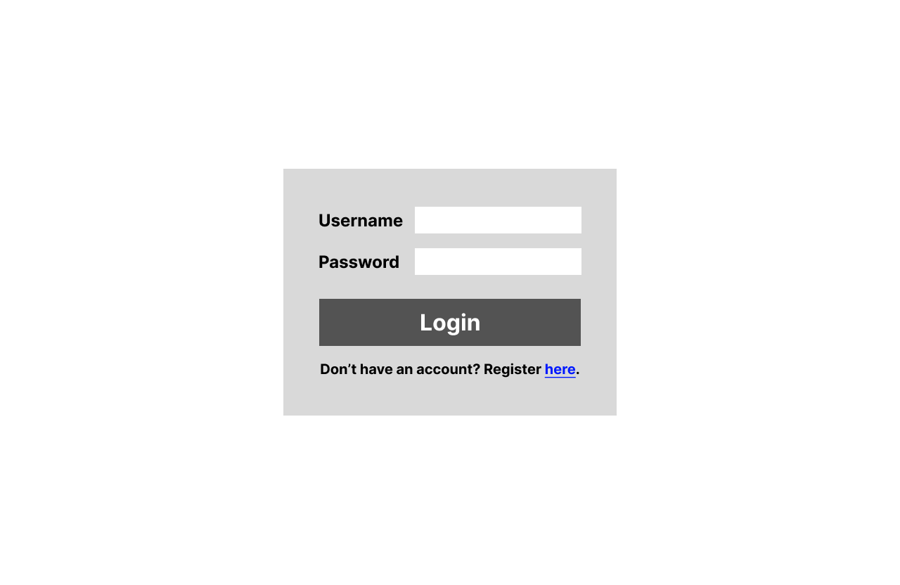      |      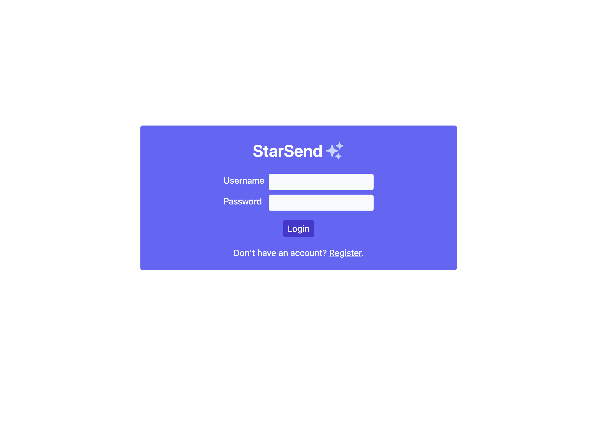      |
| Registration | 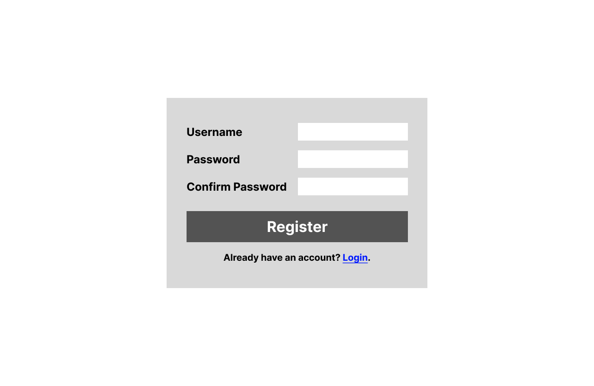 | 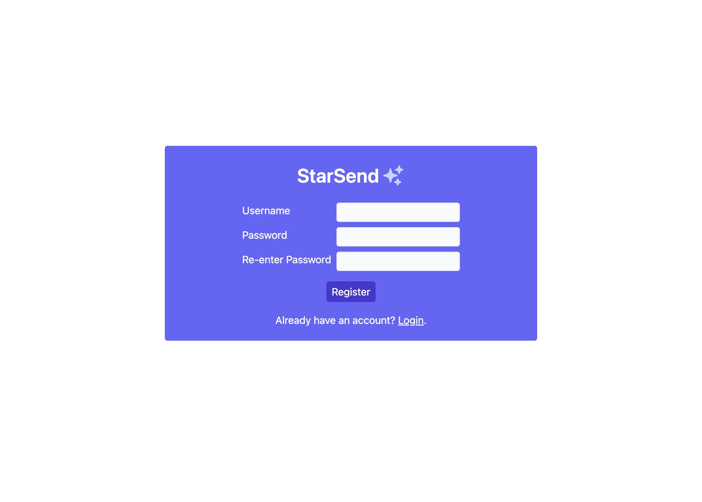 |
|    Search    |     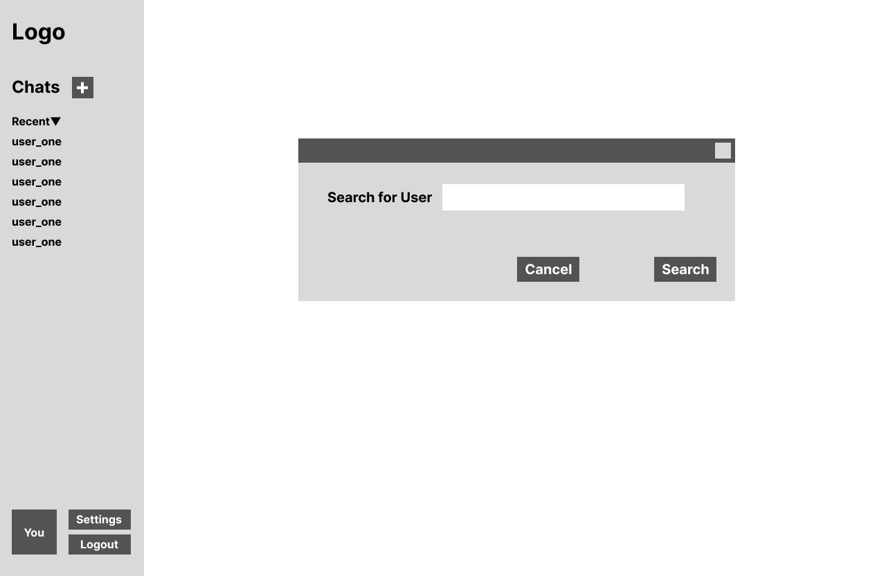     |     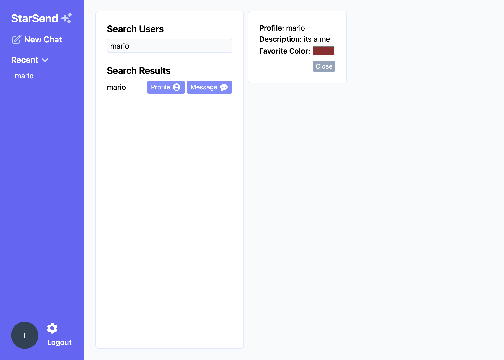     |
|     Chat     |       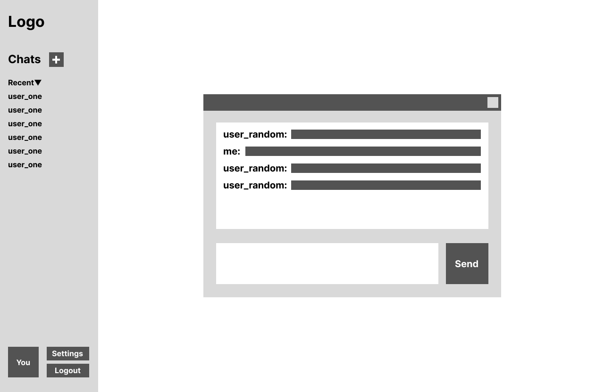       |       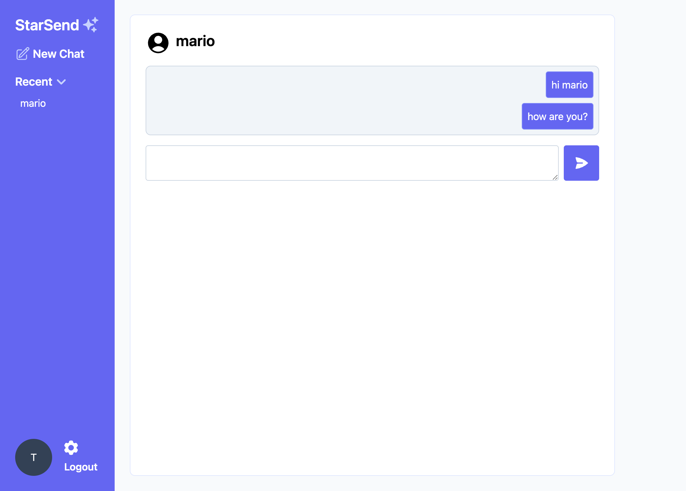       |
|   Settings   |   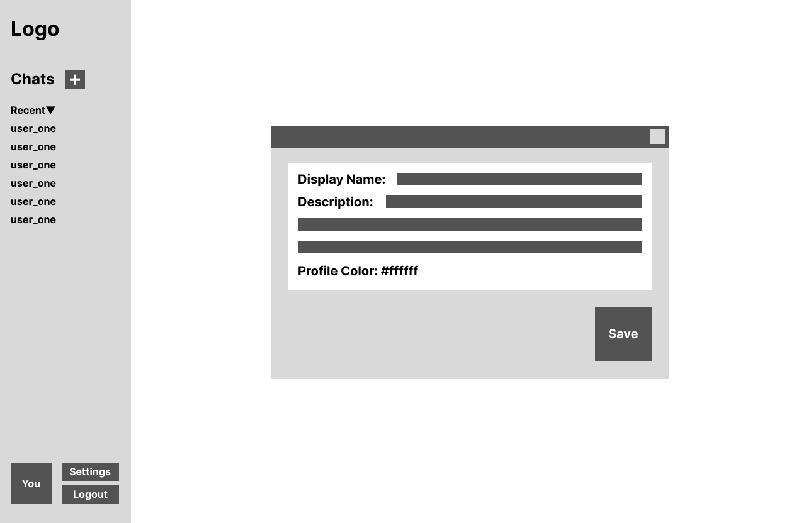   |   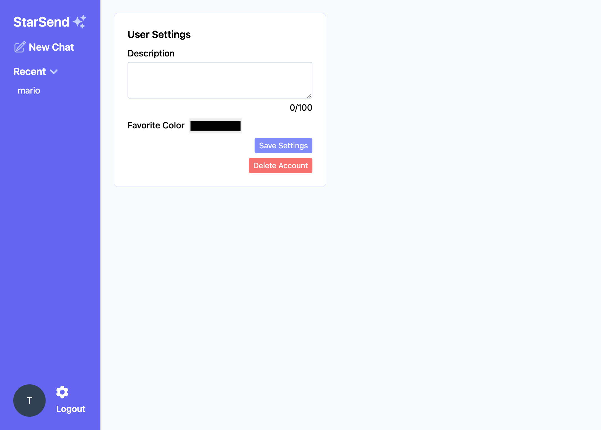   |

## Lessons Learned

- Basic WebSocket fundamentals such as opening and closing a connection.
- Debouncing search queries to limit the rate that requests are sent to the API.
- Keeping record of recently messaged users with in-memory data structures.
  - I contemplated whether to use a table in this project's relational database to keep track of the recent users but it didn't seem like a use case worth persisting for long periods of time. Plus it would put more strain on the backend to consistently poll the database for recent users during a session.
  - An ideal solution may be to save the in-memory data to the external database at the end of a session. I think Redis would be an ideal tool for this, so I'm considering integrating it later on.
